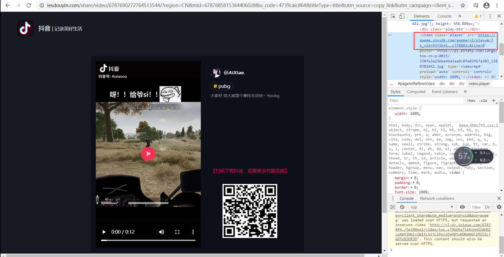
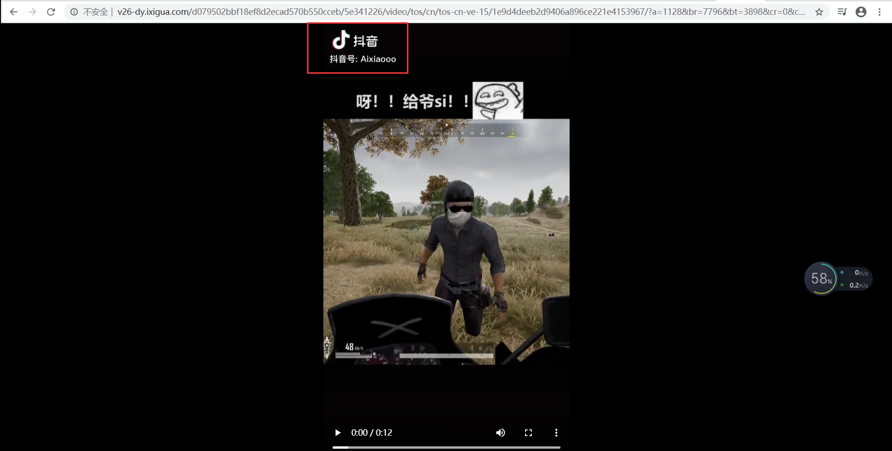
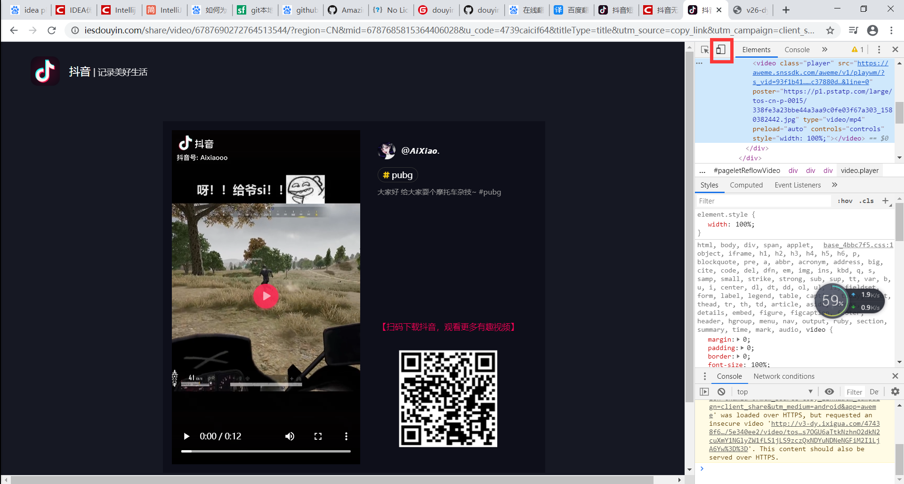
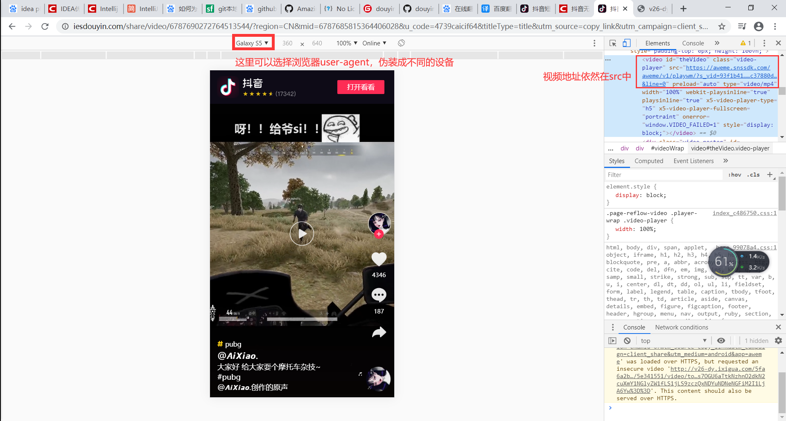

# DouYinVideoCrawler

抖音无水印小视频解析真实地址的demo（java），附上原理

# 效果

1. 请使用浏览器访问，[这里](http://www.zimo.wiki:8080/douyin-video-crawler/api/analysis?url=https://v.douyin.com/gU8REJ/)
2. 复制返回字段url中的链接在新窗口打开，即可看到没有水印的小视频，此url即为小视频真实地址（此地址大约在第二天就会失效，猜测应该是0点自动刷新token吧，此想法未验证）

# 用法

1. 使用浏览器，在地址栏输入，'http://www.zimo.wiki:8080/douyin-video-crawler/api/analysis?url='
2. 打开抖音短视频APP，点开某个视频，点击右下角分享按钮，在分享弹框中点击复制链接
3. 将复制的链接粘贴到第一步输入的链接的地址栏的最后，按<kbd>Enter</kbd>，正确的请求地址类似这样`http://www.zimo.wiki:8080/douyin-video-crawler/api/analysis?url=https://v.douyin.com/gU8REJ/`或者这样`http://www.zimo.wiki:8080/douyin-video-crawler/api/analysis?url=%23%E5%9C%A8%E6%8A%96%E9%9F%B3%EF%BC%8C%E8%AE%B0%E5%BD%95%E7%BE%8E%E5%A5%BD%E7%94%9F%E6%B4%BB%23%E5%BD%93%E6%88%91%E4%BB%AC%E6%8A%B1%E6%80%A8%E5%9B%B0%E5%9C%A8%E5%AE%B6%E9%87%8C%E7%9A%84%E6%97%B6%E5%80%99%20%E7%9F%A5%E8%B6%B3%E5%90%A7%20%E5%8F%88%E6%9C%89%E5%A4%9A%E5%B0%91%E4%BA%BA%E8%A2%AB%E5%9B%B0%E5%9C%A82020%20%20%E5%86%85%E5%AE%B9%E8%BF%87%E4%BA%8E%E7%9C%9F%E5%AE%9E%20%E9%83%BD%E5%90%AC%E8%AF%9D%E5%90%A7%EF%BC%81%20https://v.douyin.com/GfcRxD/%20%E5%A4%8D%E5%88%B6%E6%AD%A4%E9%93%BE%E6%8E%A5%EF%BC%8C%E6%89%93%E5%BC%80%E3%80%90%E6%8A%96%E9%9F%B3%E7%9F%AD%E8%A7%86%E9%A2%91%E3%80%91%EF%BC%8C%E7%9B%B4%E6%8E%A5%E8%A7%82%E7%9C%8B%E8%A7%86%E9%A2%91%EF%BC%81`
4. 在返回的数据字段找到url对应的字段，此地址即为没有水印的小视频的真实地址
5. 用浏览器请求url就可以看到无水印的小视频了

# 原理解析

1. 先在抖音复制一条小视频链接，在浏览器打开，f12调出开发者模式，选中video，可以看到播放地址直接在src中

2. 把src中的地址`https://aweme.snssdk.com/aweme/v1/playwm/?s_vid=93f1b41336a8b7a442dbf1c29c6bbc566643c365a1a8df9d3fa4bb99aa21ac37880d88309946b2a3782771c451bbd26b87f0d18011addfc5a65b2369772af4d8&line=0`复制出来，新开一个窗口请求一下看看，发现地址被重定向了，然后打开了视频播放页面，视频中有水印

3. 接着继续分析了一下此页面（电脑版），未发现什么有用的东西，在[这篇博客](https://blog.csdn.net/qq_28121913/article/details/102730184)的启发下，我尝试了一下移动端，然后发现了一些有趣的东西，在浏览器f12的页面直接选中那个标红的按钮就可以切换到移动端模式，实际上是更改了请求的user-agent

4. 和那篇博客博主所采用的实现方式不一样，老实说，这博主的实现的方式有点麻烦，但是无意中也给了我一点启发，我最开始是循着博主的思路，用java实现了一遍，发现获取到的地址是这样`https://aweme.snssdk.com/aweme/v1/play/?video_id=v0200ff10000bopbhcuvld7780ioaq1g&line=0&ratio=540p&media_type=4&vr_type=0&improve_bitrate=0&is_play_url=1&is_support_h265=0&source=PackSourceEnum_PUBLISH
`，单开一个电脑的页面来请求，发现直接无响应，但是没有403之类的，感觉有戏，于是单开一个手机端的页面，便拿到了没有水印的视频地址，然后我接着分析移动端的页面，还是那个熟悉的video标签，src中依然是视频的地址（拿出来`https://aweme.snssdk.com/aweme/v1/playwm/?s_vid=93f1b41336a8b7a442dbf1c29c6bbc566643c365a1a8df9d3fa4bb99aa21ac37880d88309946b2a3782771c451bbd26b87f0d18011addfc5a65b2369772af4d8&line=0`，请求，依然是有水印的视频）

5. 通过对比分析这三个链接，我们可以发现从src中拿出来的链接无论是手机端还是电脑端都是一模一样的，然后和iteminfo接口中获取出来的最有意思的差别就在于`play`和`playwm`，这俩应该是一个对应电脑端，一个对应手机端的播放接口，而电脑端的播放接口有水印，手机端的接口没有水印，于是问题就简单了，我们**只需要请求手机端的播放接口即可**
6. 于是我尝试直接拿src中的地址，将链接中的`playwm`直接替换为`play`，然后user-agent伪装成手机端设备请求，果然，成功了，哈哈哈
7. 具体实现请看代码CrawlerService类中的`demo1`和`demo2`方法

# 总结

不知道上面的原理大家看懂没有，没看懂也没关系，动手实操一下，实操完应该就明白了，再次整理一下我的思路
1. 获取抖音分享页面上的video标签，拿到src属性的链接
2. 将链接中的`playwm`直接替换为`play`
3. user-agent伪装成手机端设备请求
4. 拿到重定向过后的无水印的小视频的真实地址

# 致谢

感谢csdn博主@杜比爱的[博文](https://blog.csdn.net/qq_28121913/article/details/102730184)

# 声明

> 如果本仓库的内容，侵犯了你（或者你公司）的权益，请联系作者（qq：461009747）删除此仓库

# 如果觉得我写得不错，请顺手点个star，谢谢大家的支持

